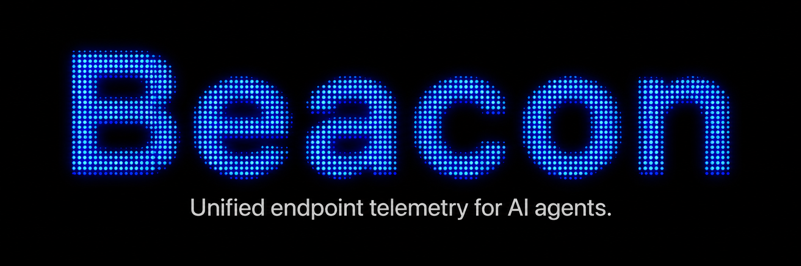
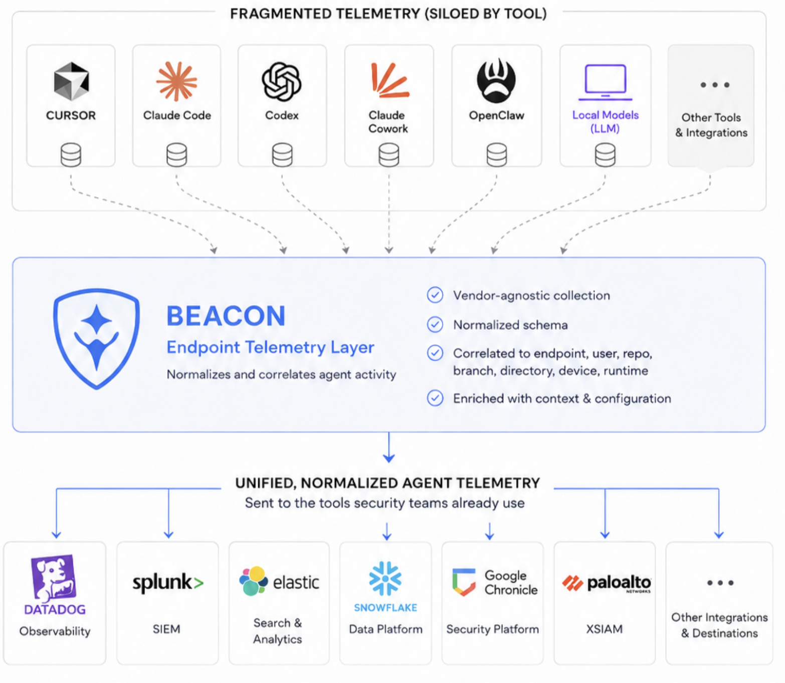

<p align="center">
  
</p>

<h1 align="center">Asymptote Lab's Beacon</h1>

<p align="center">
  <a href="https://github.com/asymptote-labs/agent-beacon/releases"></a>
  <a href="https://github.com/asymptote-labs/homebrew-tap"></a>
  <a href="https://github.com/asymptote-labs/agent-beacon/actions/workflows/ci.yml"></a>
  <a href="https://github.com/asymptote-labs/agent-beacon/blob/main/LICENSE"></a>
  <a href="https://docs.asymptotelabs.ai/cli"></a>
</p>

<p align="center">
  <strong>Unified endpoint telemetry for AI agents.</strong>
</p>

<p align="center">
  <a href="https://docs.asymptotelabs.ai/cli">Docs</a>
  ·
  <a href="https://docs.asymptotelabs.ai/cli/installation">Install</a>
  ·
  <a href="https://docs.asymptotelabs.ai/cli/security-it-teams">For Security & IT Teams</a>
  ·
  <a href="https://docs.asymptotelabs.ai/cli/dashboard">Dashboard</a>
  ·
  <a href="https://docs.asymptotelabs.ai/cli/command-reference">Commands</a>
</p>

## What Is Beacon?

Beacon is [Asymptote's open-source endpoint agent](https://justindsouza.substack.com/p/introducing-beacon-endpoint-telemetry) for security and IT teams that
need visibility into local AI agent activity.

It runs locally, captures all agent activity (e.g. prompts, tool use, file edits, etc.) from
all the [major local agent harnesses](#agent-runtimes), then
normalizes that activity into endpoint events your team can inspect and retain
locally.

Beacon is built to be easy to deploy for Security and IT teams through
[MDM deployment](#mdm-deployment) and to
emit agent harness telemetry logs to
[all the major enterprise-grade SIEMs](#siem--output-destinations).

Learn more in the [Agent Beacon Documentation](https://docs.asymptotelabs.ai/cli).

## High-Level Architecture

Beacon keeps collection, processing, and inspection local to the endpoint while
leaving forwarding under customer control.

<p align="center">
  
</p>

- **Agent runtime layer:** Local hooks and OpenTelemetry sources capture
  supported activity from AI agent harnesses on the endpoint.
- **Beacon endpoint layer:** Local processing normalizes events, applies
  retention and redaction settings, and writes durable endpoint telemetry.
- **Output layer:** Teams inspect events in the local dashboard, retain JSONL,
  or forward records into all the major enterprise-grade SIEMs.

## Supported Surfaces

Beacon captures supported agent harness activity locally and writes normalized
endpoint events that teams can inspect in place or forward into customer-managed
security pipelines.

### Agent Runtimes

Agent Beacon supports the most popular enterprise coding agent harnesses (e.g.
Claude Code, Codex, Cursor, etc.) and knowledge worker agent harnesses (e.g.
Claude Cowork, OpenClaw).

| Agent Harness | Support path |
| --- | --- |
| [Antigravity CLI](https://docs.asymptotelabs.ai/cli/supported-runtimes-antigravity-cli) | Beacon hook adapter |
| [Claude Code](https://docs.asymptotelabs.ai/cli/supported-runtimes-claude-code) | Local OpenTelemetry configuration |
| [Claude Cowork](https://docs.asymptotelabs.ai/cli/supported-runtimes-claude-cowork) | Admin-configured OpenTelemetry setup |
| [Codex CLI](https://docs.asymptotelabs.ai/cli/supported-runtimes-codex-cli) | Local OpenTelemetry configuration |
| [Cursor](https://docs.asymptotelabs.ai/cli/supported-runtimes-cursor) | Beacon hook adapter |
| [Devin](https://docs.asymptotelabs.ai/cli/supported-runtimes-devin) | Beacon hook adapter |
| [Factory Droid](https://docs.asymptotelabs.ai/cli/supported-runtimes-factory-droid) | Local OpenTelemetry configuration and optional hook adapter |
| [Gemini CLI](https://docs.asymptotelabs.ai/cli/supported-runtimes-gemini-cli) | Opt-in local OpenTelemetry configuration |
| [GitHub Copilot CLI](https://docs.asymptotelabs.ai/cli/supported-runtimes-github-copilot-cli) | MDM-managed OpenTelemetry (OTLP HTTP) |
| [Grok Build](https://docs.asymptotelabs.ai/cli/supported-runtimes-grok-build) | Beacon hook adapter |
| [OpenClaw Gateway](https://docs.asymptotelabs.ai/cli/supported-runtimes-openclaw-gateway) | Gateway-configured OTLP/HTTP export |
| [OpenCode](https://docs.asymptotelabs.ai/cli/supported-runtimes-opencode) | Beacon hook adapter |

### SIEM / Output Destinations

Agent Beacon emits agent harness telemetry logs to all the major
enterprise-grade SIEMs.

| SIEMs | Support path |
| --- | --- |
| [CrowdStrike Falcon LogScale HEC](https://docs.asymptotelabs.ai/cli/siem-forwarding-falcon) | Optional endpoint forwarding with LogScale ingest tokens during install or repair |
| [Customer-managed SIEM pipelines](https://docs.asymptotelabs.ai/cli/siem-forwarding) | Forwarding from local Beacon JSONL under customer control |
| [Datadog](https://docs.asymptotelabs.ai/cli/siem-forwarding-datadog) | Datadog Agent custom log collection over local JSONL |
| [Elastic](https://docs.asymptotelabs.ai/cli/siem-forwarding-elastic) | Filebeat or Elastic Agent content pack over local JSONL |
| [Local JSONL](https://docs.asymptotelabs.ai/cli/local-testing-logs) | Default endpoint log and local dashboard source |
| [Microsoft Sentinel](https://docs.asymptotelabs.ai/cli/siem-forwarding-microsoft-sentinel) | Azure Monitor Agent and Data Collection Rule content pack over local JSONL |
| [Rapid7 InsightIDR](https://docs.asymptotelabs.ai/cli/siem-forwarding-rapid7) | Custom Logs webhook content pack over local JSONL |
| [Splunk HEC](https://docs.asymptotelabs.ai/cli/siem-forwarding-splunk) | Optional endpoint forwarding during install or repair |
| [Sumo Logic](https://docs.asymptotelabs.ai/cli/siem-forwarding-sumo) | HTTP Logs & Metrics Source content pack over local JSONL |
| [Wazuh](https://docs.asymptotelabs.ai/cli/siem-forwarding-wazuh) | Localfile configuration and Beacon Wazuh content pack |

### MDM Deployment

Agent Beacon is designed for Security and IT teams to deploy and validate
through standard MDM workflows.

| MDM platform | Support path |
| --- | --- |
| [Fleet](https://docs.asymptotelabs.ai/cli/fleet) | macOS package and user-context deployment helpers |
| [Jamf Pro](https://docs.asymptotelabs.ai/cli/jamf) | macOS package, policy scripts, validation, and Extension Attributes |

## Dashboard

Beacon includes a local, read-only dashboard for validating endpoint activity
without a hosted backend. The overview screen summarizes recent runtime events
and collection status, while log search helps teams inspect normalized event
records during rollout, testing, and investigations.

Beacon writes endpoint activity to a stable local `runtime.jsonl` file. The
active file rotates at 10 MiB with five numbered local archives, keeping the
endpoint handoff file bounded while external SIEM forwarders continue tailing
the active path. The dashboard reads the active log plus retained numbered
archives for local triage; SIEM destinations remain the source of truth for
long-term retention and search.

<p align="center">
  
</p>

<p align="center">
  
</p>

## Start Here

- [Beacon CLI docs](https://docs.asymptotelabs.ai/cli) — full documentation index.
- [Installation](https://docs.asymptotelabs.ai/cli/installation) — install Beacon locally.
- [For Security & IT Teams](https://docs.asymptotelabs.ai/cli/security-it-teams) — rollout, validation, and security workflows.
- [Security review](https://docs.asymptotelabs.ai/cli/security-review) — review Beacon's architecture, data handling, and local-only posture.
- [Endpoint agent](https://docs.asymptotelabs.ai/cli/endpoint) — install, status, repair, and uninstall.
- [Dashboard](https://docs.asymptotelabs.ai/cli/dashboard) — inspect local runtime logs.
- [Endpoint event schema](https://docs.asymptotelabs.ai/cli/event-schema) — normalized JSONL event model.
- [Supported surfaces](https://docs.asymptotelabs.ai/cli/supported-surfaces) — supported runtimes, destinations, and boundaries.
- [Command reference](https://docs.asymptotelabs.ai/cli/command-reference) — detailed CLI command docs.

## Quickstart

See the [Quickstart](https://docs.asymptotelabs.ai/cli/quickstart) docs for the
full setup paths.

### For Security & IT Teams

Start with the
[security and IT quickstart](https://docs.asymptotelabs.ai/cli/quickstart) and
[managed deployment guidance](https://docs.asymptotelabs.ai/cli/security-it-teams)
for rollout, validation, retention, and SIEM forwarding. For vendor review, see
the [security review](https://docs.asymptotelabs.ai/cli/security-review).

### For Developers

Install the released Beacon CLI locally with Homebrew:

```bash
brew tap asymptote-labs/tap
brew install beacon
beacon version
```

Or build from source:

```bash
cd cli/beacon
make build
```

For setup, deployment, integrations, and command details, see the
[Beacon CLI docs](https://docs.asymptotelabs.ai/cli).

## License

[MIT](LICENSE)
